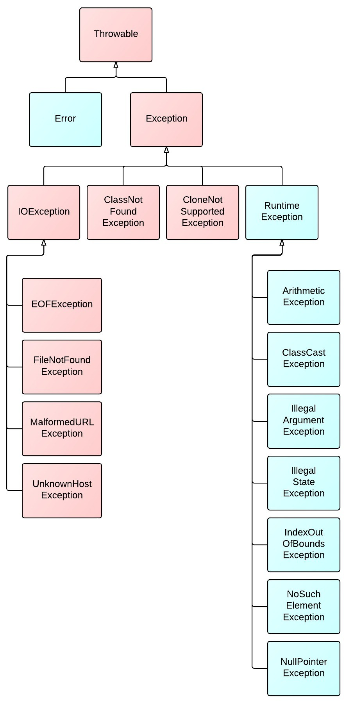

### 异常

1. 定义：非正常状态/情况，不是按照正常的路径去执行代码，偏离正常轨道；、

   ​	java是面向对象，把所有的异常情况进行归类（异常类)，程序产生异常，有一个异常对象

2. 结构：

   try……catch……finally……

   ```java
   try{
       //可能出现异常的代码
   }catch(异常类型 异常对象){
       //捕获异常
       //catch中的异常不能重复、
       //catch找到匹配的异常，就不会再匹配其它的异常
       //catch中有多个需要匹配的异常，可以使用父类异常进行合并
   }finally{
       //无论是否有异常，必须要执行
       //作用：释放资源，资源一般包括：文件资源，网络资源，数据库资源
   }
   ```

3. 常用异常

   NullPointerException

   ArrayIndexOutOfBoundsException

   ArithmeticException

   NumberFormatException

   ClassCastException

4. finally

   System.exit(-1);退出虚拟机 0：正常退出  -1：非正常退出

5. return 有异常

   catch中有return语句+finally中有return语句：

   ​	try……catch中的非return语句……【catch中的return语句，调试】

   ​	finally中的return语句……

6. 异常分类



- 粉红色的是受检查的异常(checked exceptions),其必须被 try{}catch语句块所捕获,或者在方法签名里通过throws子句声明.受检查的异常必须在编译时被捕捉处理,命名为 Checked Exception 是因为Java编译器要进行检查,Java虚拟机也要进行检查,以确保这个规则得到遵守.
- 绿色的异常是运行时异常(runtime exceptions),需要程序员自己分析代码决定是否捕获和处理,比如 空指针,被0除...
- 而声明为Error的，则属于严重错误，如系统崩溃、虚拟机错误、动态链接失败等，这些错误无法恢复或者不可能捕捉，将导致应用程序中断，Error不需要捕捉。

1. 异常分类（异常体系结构）

   异常父类：Throwable

   ​	Error：系统出现严重错误，程序本身无法解决，比如jvm宕机，线程死锁，动态链接失效

   ​	Exception：程序出现的非严重错误（程序异常），程序可以处理，也可以不处理

   ​	CheckedException：又叫非运行时异常，检查异常，这个异常必须进行处理，否则程序没办法编译

   ​		ClassNotFounfException，IOException，SQLException等

   ​	UnCheckedException：非检查异常，出现此类异常，可以处理也可以选择不处理

   ​		程序开发：推荐规避此类异常，又叫RunTimeException，通过流程控制语句规避，而不通过异常处理

   ​		举例：NullPointerException

   ​			ArrayIndexOutOfBoundsException

   ​			ArithmeticException

   ​			NumberFormatException

2. 异常处理方式

   1. 声明异常 throws…… 继续向外抛出异常
   2. 直接处理try……catch……finally……

   方法如果继续抛出异常（声明异常），一直向外扩散，直到被处理，

   项目开发中一般让异常扩散，容易找错，后面再处理

3. 编写方法：可能出现非检查异常（运行时异常）

4. throw  vs  throws

   1. throw 在方法体内手动抛出异常
   2. throws 在方法定义部分声明异常
   3. throw 和 throws 一般配合使用

5. 自定义异常

   1. 继承  Throwable
   2. 继承  Exception（推荐）

6. 异常的使用原则

   慎用异常，规避异常，尽量避免系统的业务逻辑错误不是异常

   1. 慎用异常：谨慎使用异常

   2. 规避异常：尽量避免使用异常

      CheckedException 必须使用

      UnCheckedException 尽量规避

   原因：异常处理会偏离正常的程序轨道，启动异常处理程序，会耗费更多的系统资源，得不偿失，不推荐大量使用

7. 异常的作用：Java提供功能强大的异常处理，提高代码的安全性，健壮性

### 日志

- 转换UTF-8编码：native2ascii a.txt b.txt

- 日志：

  1. 一般是用来记录系统的运行情况，有利于程序员进行代码调试和纠错

  2. 分类：

     ​	系统操作日志（登陆、退出、操作）

     ​	系统审计日志（公司审计需要查账）

     ​	系统运行日志（ip地址、网页、图片、视频资源）

     ​	系统debug日志（系统错误、警告）

  3. 使用（log4j）--》 apache 开源组织 ，很NB、

     1. 下载1.2.17

        http://logging.apache.org/log4j/1.2/（1.x）

     2. 工程下新建lib文件夹  添加log4j-1.2.17.jar  右键build path--》add to build 

     3. 在src目录下，创建配置文件log4j.properties 进行配置

        控制台输出，保存到文件，保存到数据库，发邮件

     4. 编码

        ```java
        //程序定义私有静态变量logger对象
        private static Logger logger = Logger.getLogger(Test.class.getName());
        
        //在代码中根据需要加入日志输出（日志级别）
        logger.fatal("fatal message"); //严重错误
        logger.error("error message"); //错误
        logger.warn("warn message"); //警告级别
        logger.info("info message");  //信息     相当于  System.out.println();
        logger.debug("debug message"); //调试级别
        logger.trace("trace message"); //追踪级别
        ```

        日志优先级：

        ​	fatal  >  error  >  warn  >  info  >  debug 

        代码中的日志输出，根据log4j.properties中设置的日志级别

        log4j.rootLogger = trace,stdout,logfile

        代码中日志的显示级别  >= 配置文件中设置的级别

        ```java
        文件名 log4j.properties
        
        ### 设置Logger输出级别和输出目的地###
        log4j.rootLogger = info,stdout,logfile
        
        ### 把日志信息输出到控制台 ###
        log4j.appender.stdout = org.apache.log4j.ConsoleAppender
        log4j.appender.stdout.Target = System.err
        log4j.appender.stdout.layout = org.apache.log4j.SimpleLayout
        
        ### 把日志信息输出到文件：jbit.log ###
        log4j.appender.logfile = org.apache.log4j.FileAppender
        log4j.appender.logfile.File = jbit.log
        log4j.appender.logfile.layout = org.apache.log4j.PatternLayout
        log4j.appender.logfile.layout.ConversionPattern = %d{yyyy-MM-dd HH:mm:ss}%l %F %p %m%n
        ```

     5. 作用

        跟踪系统运行情况：方便代码纠错和维护

        和System.out.println很类似，打印信息，

        日志有级别，可配置，比println输出更详细的信息

